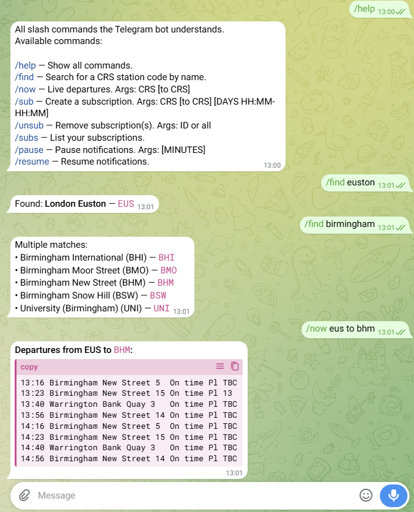
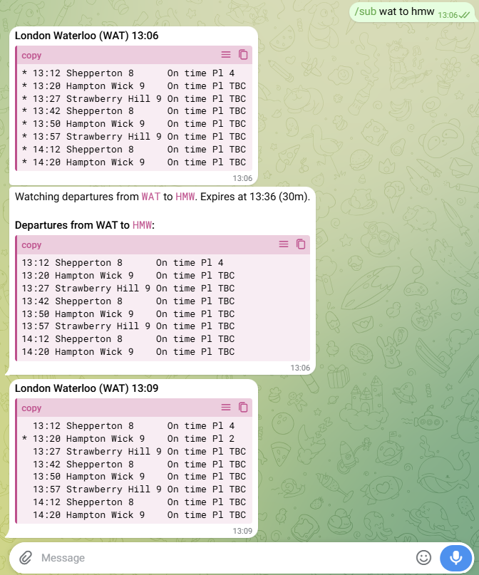

# WaitingForASignal — a UK Train Departure Notification Bot

A Rust service that sends UK railway departure notifications to users via Telegram and Twilio SMS.

It polls the National Rail Darwin API for live departure data and proactively notifies subscribers when something changes — a delay, cancellation, platform change, or early departure. Multiple users watching the same station result in a single API call.

## Why this exists

During peak hours, rail disruptions tend to hit exactly when mobile data networks are most congested. Standard railway apps become slow or unresponsive at the moment you need them most.

This bot pushes notifications to you rather than requiring you to refresh an app. SMS support is deliberate: SMS uses a separate signalling channel and gets through when data is congested, giving you a fallback that works when internet-dependent apps don't.

## Screenshots

### `/now` — live departures and station search



### `/sub` — subscription and change notifications



## Requirements

- Rust toolchain (edition 2024, stable)
- A Telegram bot token from [@BotFather](https://t.me/BotFather)
- A National Rail LDBWS API key — see below
- A Twilio account for SMS (optional) — cloud SMS, no hardware needed

## Darwin API key

Live departure data is provided by the Rail Delivery Group via [raildata.org.uk](https://raildata.org.uk).

1. Create a free account at [raildata.org.uk](https://raildata.org.uk).
2. Subscribe to the [Live Departure Board (Rail Delivery Group)](https://raildata.org.uk/dashboard/dataProduct/P-d81d6eaf-8060-4467-a339-1c833e50cbbe/overview) product.
3. Open the product page and copy the **Consumer key**.
4. Paste it into `config.toml` as `darwin.token`.

```toml
[darwin]
token = "your-ldbws-api-key-here"
```

## Twilio SMS

Twilio is the recommended SMS backend. No hardware is required — Twilio sends and receives SMS via its cloud API.

1. Create a Twilio account and provision a phone number.
2. Find your **Account SID** and **Auth Token** in the Twilio console.
3. Add a `[twilio]` section to `config.toml`:

```toml
[twilio]
account_sid        = "ACxxxxxxxxxxxxxxxxxxxxxxxxxxxxxxxx"
auth_token         = "your_auth_token"
from_number        = "+14155551234"   # your Twilio number (E.164)
poll_interval_secs = 10               # optional, default 10
```

Inbound messages are fetched by polling the Twilio Messages API. `[twilio]` and `[telegram]` can run simultaneously.

## Building

```
cargo build --release
```

The binary is placed at `target/release/waiting-for-a-signal`.

## Configuration

Copy `config.example.toml` to `config.toml` and fill in your tokens. The bot
discovers the config file in this order:

1. `--config <path>` command-line flag
2. `$WAITING_FOR_A_SIGNAL_CONFIG` environment variable
3. `/etc/waiting-for-a-signal/config.toml`
4. `./config.toml`

```toml
[telegram]
token = "123456789:ABCdefGhIjKlMnOpQrStUvWxYz"

[darwin]
token = "your-ldbws-api-key-here"

[storage]
user_data_dir = "/var/lib/waiting-for-a-signal/users"
```

At least one messaging channel (`[telegram]` or `[twilio]`) must be present. Both may be active simultaneously.

### Optional sections

| Section | Key | Default | Description |
|---------|-----|---------|-------------|
| `[darwin]` | `simulate` | `false` | Use the built-in fake departure source instead of the real API |
| `[darwin]` | `endpoint` | *(raildata.org.uk)* | LDBWS REST API base URL — only change if the endpoint moves |
| `[assets]` | `crs_csv_path` | `assets/crs.csv` | Path to the CRS station list CSV |
| `[polling]` | `interval_seconds` | `60` | How often to poll Darwin per watched station |
| `[polling]` | `departure_rows` | `10` | Departures to show per station in the live `/now` response |
| `[polling]` | `poll_rows` | `149` | Rows fetched from Darwin per polling call (should exceed `departure_rows`) |
| `[polling]` | `filter_destination_at_api` | `true` | Pass destination filter to Darwin API; set `false` to filter client-side |
| `[telegram]` | `capture_user_info` | `false` | When `true`, stores each user's Telegram display name and @username in their profile, updated on every message |
| `[twilio]` | `poll_interval_secs` | `10` | How often to poll the Twilio API for inbound messages |
| `[logging]` | `level` | `info` | Log level: `trace`, `debug`, `info`, `warn`, `error` |
| `[logging]` | `log_dir` | *(stdout)* | Directory for daily-rolling log files (`waiting-for-a-signal.log.YYYY-MM-DD`); omit to log to stdout |
| `[logging]` | `ansi` | `false` | Emit ANSI colour codes; enable only when the terminal supports them |
| `[kill_switch]` | `enabled` | `false` | When `true`, enables the `/kill` command for remote shutdown |

The config file contains secrets. Protect it:

```
chmod 600 config.toml
```

## Running

```
./waiting-for-a-signal
./waiting-for-a-signal --config /path/to/config.toml
```

## Bot commands

### Departures

| Command | Description |
|---------|-------------|
| `/now CRS` | Show next departures from a station right now |
| `/now CRS to CRS` | Filter departures to a specific destination |
| `/find NAME` | Search for a station by name and get its CRS code |

### Subscriptions

Subscriptions notify you automatically when train status changes.

| Command | Description |
|---------|-------------|
| `/sub CRS` | Watch all departures from a station (expires in 30 minutes) |
| `/sub CRS to CRS` | Watch departures to a specific destination |
| `/sub CRS DAYS HH:MM-HH:MM` | Recurring schedule — no expiry |
| `/sub CRS to CRS DAYS HH:MM-HH:MM` | Scheduled and filtered |
| `/subs` | List your active subscriptions |
| `/unsub ID` | Remove a subscription by its ID |
| `/unsub all` | Remove all subscriptions |

Days accept: `weekdays`, `weekends`, `daily`, `Mon-Fri`, `Mon,Wed,Fri`

Example:

```
/sub WAT to LBG weekdays 07:30-09:00
```

### Notifications

| Command | Description |
|---------|-------------|
| `/pause` | Pause all notifications indefinitely |
| `/pause MINUTES` | Pause notifications for a set number of minutes |
| `/resume` | Resume notifications |

## Data storage

One JSON file is written per user to `storage.user_data_dir`. Files are written
atomically. There is no database dependency.

Two CSV files are written alongside the user data directory and updated periodically:

- `metrics.csv` — aggregate counters: Darwin API requests, messages sent, total subscriptions
- `metrics_users.csv` — per-user counters: messages sent, active subscriptions

# Right to delete

I reserve the right to delete or make private this repository, and related repositories, at my own discretion without notice.

## Development

Before submitting a pull request, please:

Run ```cargo clippy``` and resolve all issues.

Run ```cargo test``` and resolve all issues.

Finally run ```cargo fmt```

To test without a Darwin API key, enable the Darwin simulator:

```toml
[darwin]
simulate = true
```

## License

Licensed under:

Apache License, Version 2.0 ([LICENSE](LICENSE) or http://www.apache.org/licenses/LICENSE-2.0)

## Contribution

Unless you explicitly state otherwise, any contribution intentionally submitted
for inclusion in the work by you, as defined in the Apache-2.0 license, shall be
licensed as above, without any additional terms or conditions.
